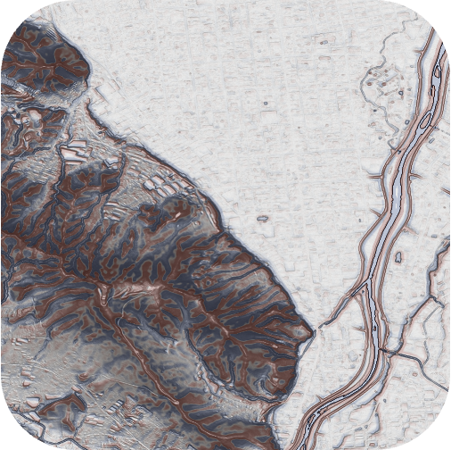
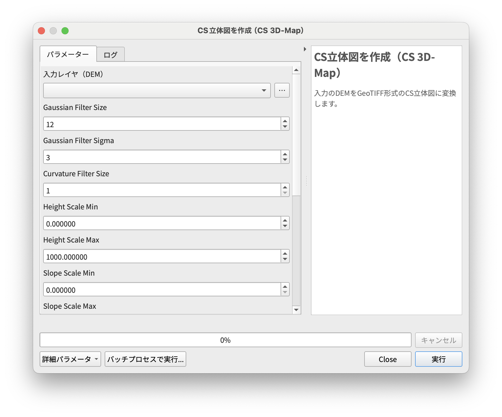

# qgis-csmap-plugin

 
_出典：基盤地図情報数値標高モデル（項目名=6441-42）を本プラグインで処理して作成_

DEM を GeoTIFF 形式の CS 立体図に変換する QGIS プラグインです。 
DEM の変換処理は[ csmap-py ](https://github.com/MIERUNE/csmap-py)を利用しているため，最新版 QGIS LTR（Windows / macOS）で動作します。 

## インストール

- 本プラグインは QGIS Python Plugin Repository で公開されているため，QGIS の『プラグイン > プラグインの管理とインストール』から `CSMap Plugin` と検索してインストール可能です。

### Windows をお使いの方へ

- Windows 版の QGIS では，プラグインの読み込みエラーが発生する場合があります。 
- [csmap-py ](https://github.com/MIERUNE/csmap-py)による DEM の変換処理は rasterio と numpy により実行されているので，Windows 版の QGIS では rasterio を手動でインストールする必要があります。以下の手順でインストールしてください。 

rasterio インストール手順：

- Python コンソールを起動します。
- `!pip install rasterio` を実行します。赤文字で `WARNING` が表示されても，最下行に `Successfully installed ~` と表示されれば問題ありません。
- QGIS を再起動して，もう一度 Python コンソールを起動します。
- `import rasterio` を実行すると，本プラグインのアイコンが表示されます。

## 使用方法

- アイコンをクリックして，プラグインを起動します。
- 入力ファイル：DEM（GDAL でサポートされている形式）を選択します。
- 出力ファイル：出力される CS 立体図の名前を指定します。
- `高度なオプション` 及び `処理終了後，自動でウィンドウを閉じる` の使用は任意です。

## Authors

- Keita Uemori([@KeiTa4446](https://github.com/KeiTa4446)
- Shota Yamamoto([@geogra-geogra](https://github.com/geogra-geogra))
