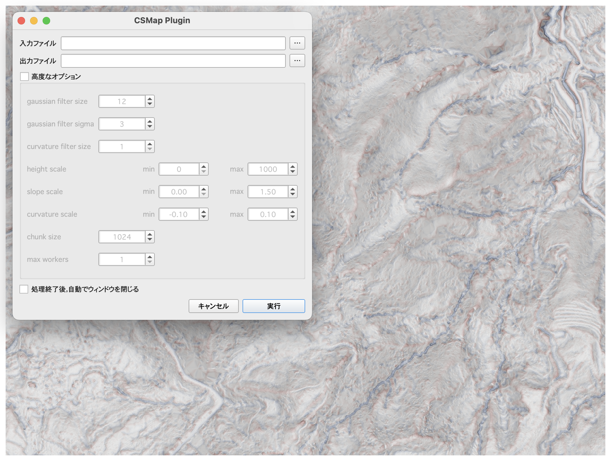

# qgis-csmap-plugin

DEMからGeoTIFF形式のCS立体図を作成するQGISプラグインです。
DEMの変換にはcsmap-pyを利用しています。
It is a QGIS plugin that creates a GeoTIFF format CS topographic map from a DEM.
The DEM conversion process is based on [csmap-py](https://github.com/MIERUNE/csmap-py).

