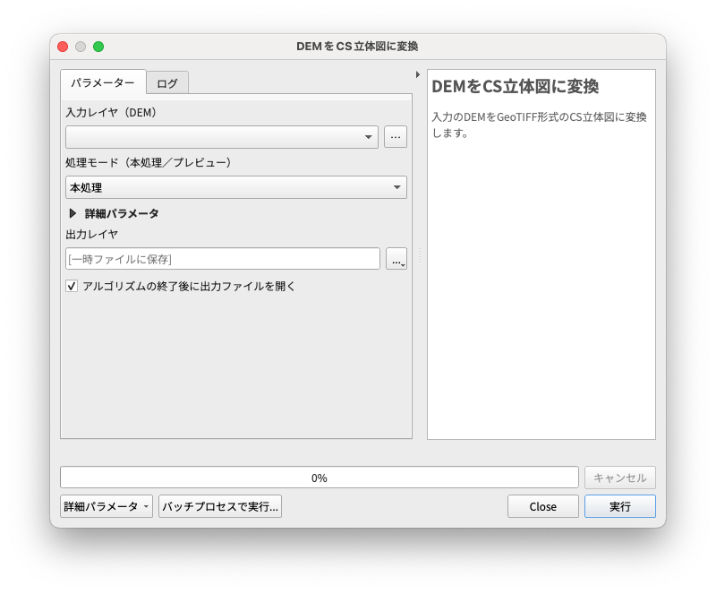
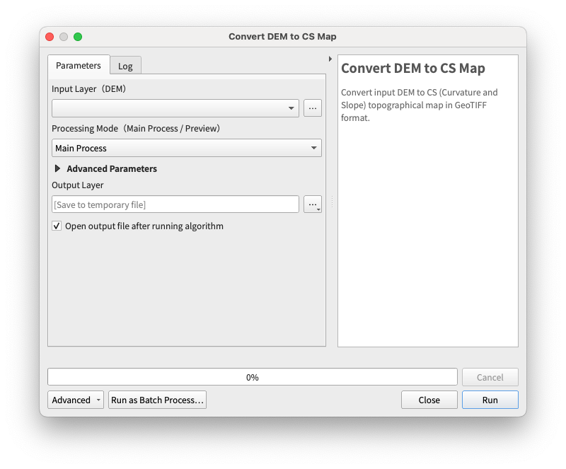

# CSMap Plugin

[日本語](#概要) / [English](#overview)

## 概要

- DEM（Digital Elevation Model: 数値標高モデル）を GeoTIFF 形式の CS 立体図に変換するプラグインです。
- DEM の変換処理には[ csmap-py ](https://github.com/MIERUNE/csmap-py)を利用しています。
- バージョン 3.32 以降の QGIS（Windows / macOS）で動作します。

## インストール

- 本プラグインは[ QGIS Python Plugin Repository ](https://plugins.qgis.org/plugins/csmap-qgis-plugin)で公開されています。
- QGIS の［プラグインの管理とインストール］から `CSMap Plugin` と検索してインストールできます。

### Windows をお使いの方へ

- Windows 版の QGIS では、プラグインの読み込みエラーが発生する場合があります。 
- [ csmap-py ](https://github.com/MIERUNE/csmap-py)による DEM の変換処理は rasterio と numpy により実行されているので，Windows 版の QGIS では rasterio を手動でインストールする必要があります。以下の手順でインストールしてください。 

rasterio インストール手順：

- Python コンソールを起動します。
- `!pip install rasterio` を実行します。赤文字で `WARNING` が表示されても，最下行に `Successfully installed ~` と表示されれば問題ありません。
- QGIS を再起動して，もう一度 Python コンソールを起動します。
- `import rasterio` を実行すると，本プラグインのアイコンが表示されます。

## 使用方法

- ツールバーまたはプロセシングツールボックスからプラグインを起動します。
- 入力レイヤ（DEM）
  - GDAL でサポートされている形式の DEM を指定します。
  - レイヤパネルに追加済みのデータ、またはファイルから選択できます。
- 処理モード
  - 本処理：入力 DEM を CS 立体図に変換します。
  - プレビュー：詳細パラメータの設定後、色合いを確認できます。
- 詳細パラメータ
  - 必要に応じてパラメータを設定できます。
- 出力レイヤ
  - デフォルトでは一時ファイルとして保存されます。
  - 必要に応じてファイルに出力できます。
- 設定が完了したら、［実行］ボタンをクリックして変換を開始します。

## Overview

- A plugin that converts DEM (Digital Elevation Model) into CS (Curvature and Slope) topographical maps in GeoTIFF format.
- The DEM conversion process uses[ csmap-py ](https://github.com/MIERUNE/csmap-py).
- Works with QGIS version 3.32 and later (Windows / macOS).

## Installation

- This plugin is available on the [QGIS Python Plugin Repository](https://plugins.qgis.org/plugins/csmap-qgis-plugin).
- You can install it by searching for `CSMap Plugin` in QGIS's 'Plugins Manager'.

### For Windows Users

- Plugin loading errors may occur in the Windows version of QGIS.
- Since DEM conversion processing using[ csmap-py ](https://github.com/MIERUNE/csmap-py)is executed by rasterio and numpy, you need to manually install rasterio in the Windows version of QGIS. Please follow these installation steps:

rasterio installation steps:

- Launch the Python console.
- Execute `!pip install rasterio`. Even if `WARNING` appears in red text, there's no problem as long as `Successfully installed ~` is displayed at the bottom line.
- Restart QGIS and launch the Python console again.
- Execute `import rasterio`, and the plugin icon will appear.

## Usage

- Launch the plugin from the toolbar or Processing Toolbox.
- Input Layer (DEM)
  - Specify a DEM in any format supported by GDAL.
  - You can select from data already added to the layer panel or from a file.
- Processing Mode
  - Main Processing: Converts input DEM to CS Relief Map.
  - Preview: Allows you to check color schemes after setting detailed parameters.
- Detailed Parameters
  - Parameters can be configured as needed.
- Output Layer
  - By default, it is saved as a temporary file.
  - You can output to a file if needed.
- Once settings are complete, click the [Run] button to start the conversion.

## Authors

- Keita Uemori([@Geo-Jagaimo](https://github.com/Geo-Jagaimo))
- Shota Yamamoto([@geogra-geogra](https://github.com/geogra-geogra))
